# Udactity Data Analyst

## Multivariate Visualizations Excercises

### Scatterplots


```python
import pandas as pd
import seaborn as sb
import matplotlib.pyplot as plt
import numpy as np

%matplotlib inline
```


```python
fuel_econ = pd.read_csv('fuel-econ.csv')
```


```python
sedan_classes = ['Minicompact Cars', 'Subcompact Cars', 'Compact Cars', 'Midsize Cars', 'Large Cars']
vclasses = pd.api.types.CategoricalDtype(ordered = True, categories = sedan_classes)
fuel_econ['VClass'] = fuel_econ['VClass'].astype(vclasses)
```


```python
fuel_econ['trans_type'] = fuel_econ['trans'].apply(lambda x: x.split()[0])
```


```python
fuel_econ.sample(3)
```


<div>
<style scoped>
    .dataframe tbody tr th:only-of-type {
        vertical-align: middle;
    }

    .dataframe tbody tr th {
        vertical-align: top;
    }

    .dataframe thead th {
        text-align: right;
    }
</style>
<table border="1" class="dataframe">
  <thead>
    <tr style="text-align: right;">
      <th></th>
      <th>id</th>
      <th>make</th>
      <th>model</th>
      <th>year</th>
      <th>VClass</th>
      <th>drive</th>
      <th>trans</th>
      <th>fuelType</th>
      <th>cylinders</th>
      <th>displ</th>
      <th>...</th>
      <th>pv4</th>
      <th>city</th>
      <th>UCity</th>
      <th>highway</th>
      <th>UHighway</th>
      <th>comb</th>
      <th>co2</th>
      <th>feScore</th>
      <th>ghgScore</th>
      <th>trans_type</th>
    </tr>
  </thead>
  <tbody>
    <tr>
      <th>221</th>
      <td>32700</td>
      <td>Audi</td>
      <td>A6</td>
      <td>2013</td>
      <td>Midsize Cars</td>
      <td>Front-Wheel Drive</td>
      <td>Automatic (AV-S8)</td>
      <td>Premium Gasoline</td>
      <td>4</td>
      <td>2.0</td>
      <td>...</td>
      <td>98</td>
      <td>24.5044</td>
      <td>31.4000</td>
      <td>32.5529</td>
      <td>46.9000</td>
      <td>27.5721</td>
      <td>320</td>
      <td>7</td>
      <td>7</td>
      <td>Automatic</td>
    </tr>
    <tr>
      <th>97</th>
      <td>32492</td>
      <td>Infiniti</td>
      <td>M56x</td>
      <td>2013</td>
      <td>Midsize Cars</td>
      <td>All-Wheel Drive</td>
      <td>Automatic (S7)</td>
      <td>Premium Gasoline</td>
      <td>8</td>
      <td>5.6</td>
      <td>...</td>
      <td>104</td>
      <td>15.6967</td>
      <td>19.4593</td>
      <td>22.9117</td>
      <td>31.9986</td>
      <td>18.2883</td>
      <td>487</td>
      <td>4</td>
      <td>4</td>
      <td>Automatic</td>
    </tr>
    <tr>
      <th>130</th>
      <td>32545</td>
      <td>Chevrolet</td>
      <td>Cruze</td>
      <td>2013</td>
      <td>Midsize Cars</td>
      <td>Front-Wheel Drive</td>
      <td>Automatic (S6)</td>
      <td>Regular Gasoline</td>
      <td>4</td>
      <td>1.8</td>
      <td>...</td>
      <td>94</td>
      <td>22.3233</td>
      <td>28.5000</td>
      <td>33.8346</td>
      <td>49.1000</td>
      <td>26.3588</td>
      <td>336</td>
      <td>7</td>
      <td>7</td>
      <td>Automatic</td>
    </tr>
  </tbody>
</table>
<p>3 rows × 21 columns</p>
</div>


```python
# Choose random 200 entries to make a plot without much overlapping
np.random.seed(2018)
sample = np.random.choice(fuel_econ.shape[0], 200, replace = False)
fuel_econ_subset = fuel_econ.loc[sample]
```


```python
sb.regplot(data = fuel_econ_subset, x = 'displ', y = 'comb', x_jitter = 0.04, fit_reg = False)
plt.xlabel('Displacement (l)');
plt.ylabel('Combines Fuel Eff. (mpg)');
```


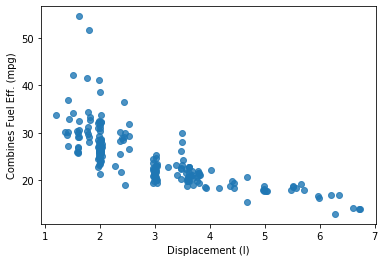


```python
# Make a plot with the third qualitative variable, transmission type, being plotted via shape
ttype_markers = [['Automatic', 'o'], ['Manual', '^']]
for ttype, marker in ttype_markers:
    plot_data = fuel_econ_subset.loc[fuel_econ_subset['trans_type'] == ttype]
    sb.regplot(data = plot_data, x = 'displ', y = 'comb', x_jitter = 0.04, 
               fit_reg = False, marker = marker);
plt.xlabel('Displacement (l)');
plt.ylabel('Combines Fuel Eff. (mpg)');
plt.legend(['Automatic', 'Manual']);
```


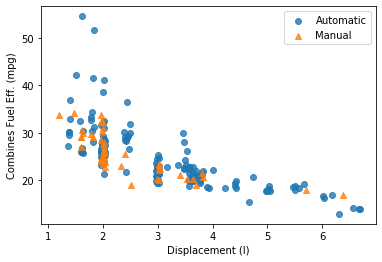


```python
# Make a plot with the third quantitative variable, co2 emission, plotted via size
sb.regplot(data = fuel_econ_subset, x = 'displ', y = 'comb', x_jitter = 0.04, fit_reg = False,
          scatter_kws = {'s': fuel_econ_subset['co2']/2});
plt.xlabel('Displacement (l)');
plt.ylabel('Combines Fuel Eff. (mpg)');
```


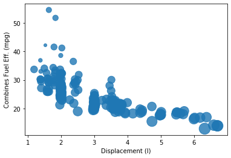


```python
# Build a legend to the last plot
sb.regplot(data = fuel_econ_subset, x = 'displ', y = 'comb', x_jitter = 0.04, fit_reg = False,
          scatter_kws = {'s': fuel_econ_subset['co2']/2});
plt.xlabel('Displacement (l)');
plt.ylabel('Combines Fuel Eff. (mpg)');

sizes = [200, 350, 500]
base_color = sb.color_palette()[0]
legend_obj = []
for s in sizes:
    legend_obj.append(plt.scatter([],[], s = s/2, color = base_color))
plt.legend(legend_obj, sizes, title = 'CO2 (g/mi)');
```


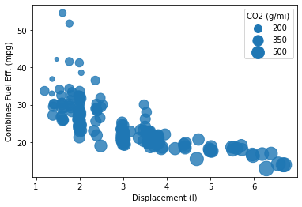


### Encoding via Color

Color is a very common encoding for variables, for both qualitative and quantitative variables. If you have a qualitative variable, you can set different colors for different levels of a categorical variable through the "hue" parameter on seaborn's FacetGrid class.


```python
# Make a plot with the third variable being encoded via color
g = sb.FacetGrid(data = fuel_econ_subset , hue = 'trans_type')
g.map(sb.regplot, 'displ', 'comb', x_jitter = 0.04, fit_reg = False);
plt.xlabel('Displacement (l)');
plt.ylabel('Combines Fuel Eff. (mpg)');
```


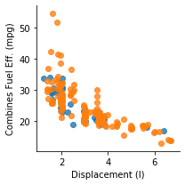


```python
g = sb.FacetGrid(data = fuel_econ_subset , hue = 'trans_type', 
                 hue_order = ['Automatic', 'Manual'], height = 4, aspect = 1.5)
g = g.map(sb.regplot, 'displ', 'comb', x_jitter = 0.04, fit_reg = False);
g.add_legend()
plt.xlabel('Displacement (l)');
plt.ylabel('Combines Fuel Eff. (mpg)');
```


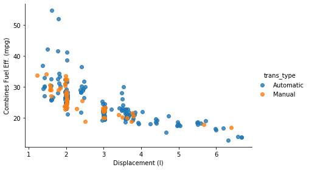


```python
g = sb.FacetGrid(data = fuel_econ_subset , hue = 'VClass', height = 4, 
                 aspect = 1.5, palette = 'viridis_r')
g = g.map(sb.regplot, 'displ', 'comb', x_jitter = 0.04, fit_reg = False);
g.add_legend()
plt.xlabel('Displacement (l)');
plt.ylabel('Combines Fuel Eff. (mpg)');
```


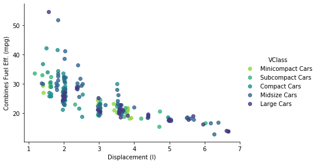


For quantitative variables, we should not take the same approach, since `FacetGrid` expects any variable input for subsetting to be categorical. Instead, we can set color based on numeric value in the scatter function through the `c` parameter.


```python
plt.scatter(data = fuel_econ_subset, x = 'displ', y = 'comb', c = 'co2',
               cmap = 'viridis_r');
plt.colorbar(label = 'CO2 (g/mi)')
plt.xlabel('Displacement (l)');
plt.ylabel('Combines Fuel Eff. (mpg)');
```


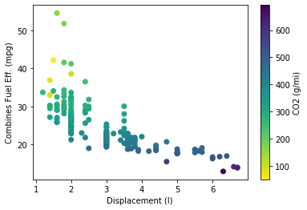


### Color Palettes

There are three major classes of color palette to consider: qualitative, sequential, and diverging.

Qualitative palettes are built for nominal-type data. This is the palette class taken by the default palette.


```python
sb.palplot(sb.color_palette(n_colors=9))
```


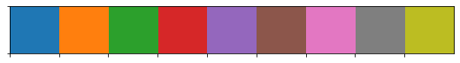


For other types of data (ordinal and numeric), a choice may need to be made between a sequential scale and a diverging scale. A sequential palette follows a light-to-dark trend across a single or small range of hues, where light colors indicate low values and dark colors indicate high values. The default sequential color map, `viridis`, takes the opposite approach, with dark colors indicating low values, and light values indicating high.


```python
sb.palplot(sb.color_palette('viridis', 9))
```


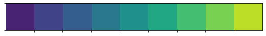


If there is a meaningful zero or center value for the variable, you may want to consider using a `diverging` palette. In a diverging palette, two sequential palettes with different hues are put back to back, with a common color (usually white or gray) connecting them. One hue indicates values greater than the center point, while the other indicates values smaller than the center.


```python
sb.palplot(sb.color_palette('vlag', 9))
```


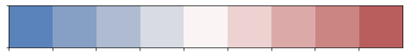


### Faceting for Multivariate Data

We can facet bivariate plots to create a multivariate visualization.


```python
fuel_econ = pd.read_csv('fuel-econ.csv')
fuel_econ.head()
```


<div>
<style scoped>
    .dataframe tbody tr th:only-of-type {
        vertical-align: middle;
    }

    .dataframe tbody tr th {
        vertical-align: top;
    }

    .dataframe thead th {
        text-align: right;
    }
</style>
<table border="1" class="dataframe">
  <thead>
    <tr style="text-align: right;">
      <th></th>
      <th>id</th>
      <th>make</th>
      <th>model</th>
      <th>year</th>
      <th>VClass</th>
      <th>drive</th>
      <th>trans</th>
      <th>fuelType</th>
      <th>cylinders</th>
      <th>displ</th>
      <th>pv2</th>
      <th>pv4</th>
      <th>city</th>
      <th>UCity</th>
      <th>highway</th>
      <th>UHighway</th>
      <th>comb</th>
      <th>co2</th>
      <th>feScore</th>
      <th>ghgScore</th>
    </tr>
  </thead>
  <tbody>
    <tr>
      <th>0</th>
      <td>32204</td>
      <td>Nissan</td>
      <td>GT-R</td>
      <td>2013</td>
      <td>Subcompact Cars</td>
      <td>All-Wheel Drive</td>
      <td>Automatic (AM6)</td>
      <td>Premium Gasoline</td>
      <td>6</td>
      <td>3.8</td>
      <td>79</td>
      <td>0</td>
      <td>16.4596</td>
      <td>20.2988</td>
      <td>22.5568</td>
      <td>30.1798</td>
      <td>18.7389</td>
      <td>471</td>
      <td>4</td>
      <td>4</td>
    </tr>
    <tr>
      <th>1</th>
      <td>32205</td>
      <td>Volkswagen</td>
      <td>CC</td>
      <td>2013</td>
      <td>Compact Cars</td>
      <td>Front-Wheel Drive</td>
      <td>Automatic (AM-S6)</td>
      <td>Premium Gasoline</td>
      <td>4</td>
      <td>2.0</td>
      <td>94</td>
      <td>0</td>
      <td>21.8706</td>
      <td>26.9770</td>
      <td>31.0367</td>
      <td>42.4936</td>
      <td>25.2227</td>
      <td>349</td>
      <td>6</td>
      <td>6</td>
    </tr>
    <tr>
      <th>2</th>
      <td>32206</td>
      <td>Volkswagen</td>
      <td>CC</td>
      <td>2013</td>
      <td>Compact Cars</td>
      <td>Front-Wheel Drive</td>
      <td>Automatic (S6)</td>
      <td>Premium Gasoline</td>
      <td>6</td>
      <td>3.6</td>
      <td>94</td>
      <td>0</td>
      <td>17.4935</td>
      <td>21.2000</td>
      <td>26.5716</td>
      <td>35.1000</td>
      <td>20.6716</td>
      <td>429</td>
      <td>5</td>
      <td>5</td>
    </tr>
    <tr>
      <th>3</th>
      <td>32207</td>
      <td>Volkswagen</td>
      <td>CC 4motion</td>
      <td>2013</td>
      <td>Compact Cars</td>
      <td>All-Wheel Drive</td>
      <td>Automatic (S6)</td>
      <td>Premium Gasoline</td>
      <td>6</td>
      <td>3.6</td>
      <td>94</td>
      <td>0</td>
      <td>16.9415</td>
      <td>20.5000</td>
      <td>25.2190</td>
      <td>33.5000</td>
      <td>19.8774</td>
      <td>446</td>
      <td>5</td>
      <td>5</td>
    </tr>
    <tr>
      <th>4</th>
      <td>32208</td>
      <td>Chevrolet</td>
      <td>Malibu eAssist</td>
      <td>2013</td>
      <td>Midsize Cars</td>
      <td>Front-Wheel Drive</td>
      <td>Automatic (S6)</td>
      <td>Regular Gasoline</td>
      <td>4</td>
      <td>2.4</td>
      <td>0</td>
      <td>95</td>
      <td>24.7726</td>
      <td>31.9796</td>
      <td>35.5340</td>
      <td>51.8816</td>
      <td>28.6813</td>
      <td>310</td>
      <td>8</td>
      <td>8</td>
    </tr>
  </tbody>
</table>
</div>


```python
g = sb.FacetGrid(data = fuel_econ, col = 'VClass')
g.map(plt.scatter, 'displ', 'comb');
```


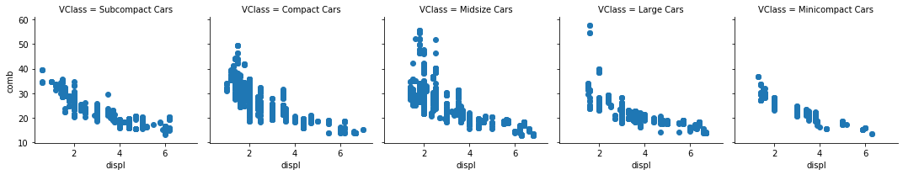


```python
fuel_econ['trans_type'] = fuel_econ['trans'].apply(lambda x: x.split()[0])
```


```python
g = sb.FacetGrid(data = fuel_econ, col = 'VClass', row = 'trans_type',
                margin_titles = True)
g.map(plt.scatter, 'displ', 'comb');
```


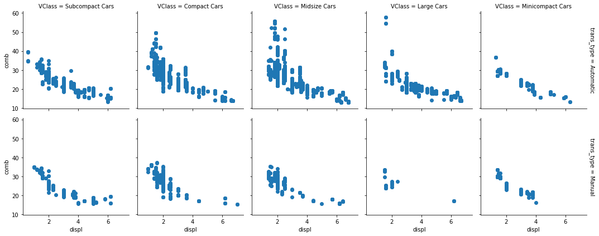


`FacetGrid` also allows for faceting a variable not just by columns, but also by rows. We can set one categorical variable on each of the two facet axes for one additional method of depicting multivariate trends.

Setting `margin_titles = True` means that instead of each facet being labeled with the combination of row and column variable, labels are placed separately on the top and right margins of the facet grid. 

### Other adaptations of bivariate plots

An alternative approach for two categorical variables and one numeric variable is to adapt a clustered bar chart using the `barplot` function instead of the countplot function:


```python
sb.barplot(data = fuel_econ, x = 'VClass', y = 'comb', hue = 'trans_type',  ci = 'sd')
plt.xticks(rotation = 15)
plt.ylabel('Average combined efficiency (mpg)');
```


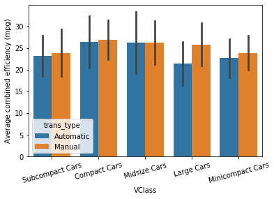


The "hue" parameter can also be used in a similar fashion in the `boxplot`, `violinplot`, and `pointplot` functions to add a categorical third variable to those plots in a clustered fashion. As a special note for pointplot, the default rendering aligns all levels of the "hue" categorical variable vertically. Use the "dodge" parameter to shift the levels in a clustered fashion:


```python
sb.pointplot(data = fuel_econ, x = 'VClass', y = 'comb', hue = 'trans_type',
            ci = 'sd', linestyles = '', dodge = True)
plt.xticks(rotation = 15)
plt.ylabel('Average combined efficiency (mpg)');
```


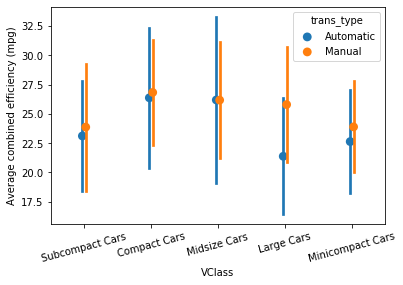


```python
sb.boxplot(data = fuel_econ, x = 'VClass', y = 'comb', hue = 'trans_type')
plt.xticks(rotation = 15)
plt.ylabel('Average combined efficiency (mpg)');
```


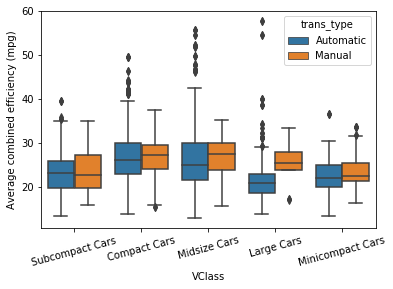


```python
sb.violinplot(data = fuel_econ, x = 'VClass', y = 'comb', hue = 'trans_type')
plt.xticks(rotation = 15)
plt.ylabel('Average combined efficiency (mpg)');
```


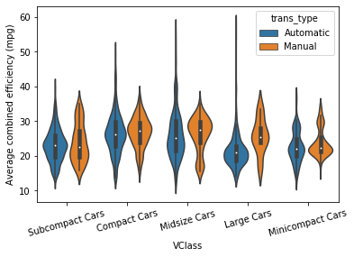


Substituting count on a bar chart or histogram for the mean, median, or some other statistic of a second variable can also be done for bivariate plots like the heat map, clustered bar chart, and line plot, to allow them to depict multivariate relationships.

If we want to depict the mean of a third variable in a 2-d histogram, we need to change the weights of points in the `hist2d` function similar to how we changed the weights in the 1-d histogram.


```python
bins_x = np.arange(0.6, 7+0.3, 0.3)
bins_y = np.arange(12, 58 +3, 3)
plt.hist2d(data = fuel_econ, x = 'displ', y = 'comb', cmin = 0.5, cmap = 'viridis_r',
          bins = [bins_x, bins_y])
plt.colorbar();
```


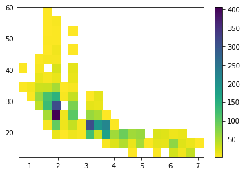


```python
displ_bins = pd.cut(fuel_econ['displ'], bins_x, right = False, include_lowest = False, labels = False).astype(int)
comb_bins = pd.cut(fuel_econ['comb'], bins_y, right = False, include_lowest = False, labels = False).astype(int)
displ_bins.sample(5)
```


    506     12
    737     13
    1956     4
    902      3
    786     11
    Name: displ, dtype: int64


```python
comb_bins.sample(5)
```


    3418    3
    774     2
    368     4
    3353    6
    725     2
    Name: comb, dtype: int64


```python
n_points = fuel_econ.groupby([displ_bins, comb_bins]).size()
n_points
```


    displ  comb
    0      7         3
           9         3
    1      6         4
           7         8
    2      5        42
           6        62
           7        31
           8        15
           9         7
           10        4
    3      3         6
           4        55
           5       130
           6       119
           7        34
           8         7
           10        7
           11        2
           12        4
           13        1
           14        2
           15        2
    4      2        15
           3        98
           4       405
           5       311
           6       145
           7        55
           8        14
           9        26
                  ... 
    9      6        18
    10     1         5
           2       173
           3       219
           4         2
    11     1        22
           2        58
           3         4
    12     1        48
           2        92
    13     0         1
           1        15
           2        59
    14     1        55
           2        64
    15     1         4
    16     0         3
           1        17
           2        24
    17     1        16
           2        20
    18     0        29
           1        70
           2        12
    19     0        10
           1        20
           2        15
    20     0        38
           1        13
    21     1         2
    Length: 91, dtype: int64


```python
n_points = n_points.reset_index().pivot(index = 'displ', columns = 'comb').values
n_points
```


    array([[ nan,  nan,  nan,  nan,  nan,  nan,  nan,   3.,  nan,   3.,  nan,
             nan,  nan,  nan,  nan,  nan],
           [ nan,  nan,  nan,  nan,  nan,  nan,   4.,   8.,  nan,  nan,  nan,
             nan,  nan,  nan,  nan,  nan],
           [ nan,  nan,  nan,  nan,  nan,  42.,  62.,  31.,  15.,   7.,   4.,
             nan,  nan,  nan,  nan,  nan],
           [ nan,  nan,  nan,   6.,  55., 130., 119.,  34.,   7.,  nan,   7.,
              2.,   4.,   1.,   2.,   2.],
           [ nan,  nan,  15.,  98., 405., 311., 145.,  55.,  14.,  26.,   6.,
             10.,   3.,   3.,   5.,  nan],
           [ nan,  nan,   1.,  12.,   9.,  nan,   5.,   1.,  nan,  nan,  nan,
             nan,  nan,  nan,  nan,  nan],
           [ nan,  nan,  11.,  37., 105.,  82.,  37.,   5.,  15.,  17.,  nan,
              1.,  nan,   1.,  nan,  nan],
           [ nan,  nan,   7.,   6.,  nan,  nan,  nan,  nan,  nan,  nan,  nan,
             nan,  nan,  nan,  nan,  nan],
           [ nan,  nan, 123., 311.,  64.,  17.,   2.,  nan,  nan,  nan,  nan,
             nan,  nan,  nan,  nan,  nan],
           [ nan,  nan,  32., 190.,  52.,  14.,  18.,  nan,  nan,  nan,  nan,
             nan,  nan,  nan,  nan,  nan],
           [ nan,   5., 173., 219.,   2.,  nan,  nan,  nan,  nan,  nan,  nan,
             nan,  nan,  nan,  nan,  nan],
           [ nan,  22.,  58.,   4.,  nan,  nan,  nan,  nan,  nan,  nan,  nan,
             nan,  nan,  nan,  nan,  nan],
           [ nan,  48.,  92.,  nan,  nan,  nan,  nan,  nan,  nan,  nan,  nan,
             nan,  nan,  nan,  nan,  nan],
           [  1.,  15.,  59.,  nan,  nan,  nan,  nan,  nan,  nan,  nan,  nan,
             nan,  nan,  nan,  nan,  nan],
           [ nan,  55.,  64.,  nan,  nan,  nan,  nan,  nan,  nan,  nan,  nan,
             nan,  nan,  nan,  nan,  nan],
           [ nan,   4.,  nan,  nan,  nan,  nan,  nan,  nan,  nan,  nan,  nan,
             nan,  nan,  nan,  nan,  nan],
           [  3.,  17.,  24.,  nan,  nan,  nan,  nan,  nan,  nan,  nan,  nan,
             nan,  nan,  nan,  nan,  nan],
           [ nan,  16.,  20.,  nan,  nan,  nan,  nan,  nan,  nan,  nan,  nan,
             nan,  nan,  nan,  nan,  nan],
           [ 29.,  70.,  12.,  nan,  nan,  nan,  nan,  nan,  nan,  nan,  nan,
             nan,  nan,  nan,  nan,  nan],
           [ 10.,  20.,  15.,  nan,  nan,  nan,  nan,  nan,  nan,  nan,  nan,
             nan,  nan,  nan,  nan,  nan],
           [ 38.,  13.,  nan,  nan,  nan,  nan,  nan,  nan,  nan,  nan,  nan,
             nan,  nan,  nan,  nan,  nan],
           [ nan,   2.,  nan,  nan,  nan,  nan,  nan,  nan,  nan,  nan,  nan,
             nan,  nan,  nan,  nan,  nan]])


```python
co2_weights = fuel_econ['co2'] / n_points[displ_bins, comb_bins]
co2_weights
```


    0        2.722543
    1        0.861728
    2        2.479769
    3        2.578035
    4        3.780488
    5        2.068421
    6        2.168421
    7       28.800000
    8        3.826531
    9        2.664740
    10       1.917808
    11       0.888889
    12       2.450867
    13      13.937500
    14       1.926941
    15       2.676301
    16      13.312500
    17      13.937500
    18      13.312500
    19       2.078947
    20       1.762557
    21       1.840183
    22       6.843750
    23       7.390625
    24       1.789954
    25       2.445378
    26       2.378151
    27       2.344538
    28       1.958621
    29       1.958621
              ...    
    3899     2.462185
    3900     2.369231
    3901    43.363636
    3902     0.809877
    3903     3.806122
    3904     7.265625
    3905     0.851852
    3906     2.221053
    3907     2.042105
    3908     2.221053
    3909    20.058824
    3910    10.854167
    3911     3.238095
    3912     1.028939
    3913     9.666667
    3914     9.666667
    3915     0.827160
    3916     4.000000
    3917     3.682927
    3918     3.190476
    3919     1.482759
    3920     0.993569
    3921     0.881481
    3922    22.428571
    3923     6.538462
    3924    15.600000
    3925     8.346154
    3926    35.333333
    3927     2.036842
    3928     2.194737
    Name: co2, Length: 3929, dtype: float64


```python
bins_x = np.arange(0.6, 7+0.3, 0.3)
bins_y = np.arange(12, 58 +3, 3)
plt.hist2d(data = fuel_econ, x = 'displ', y = 'comb', cmin = 0.5, cmap = 'viridis_r',
          bins = [bins_x, bins_y], weights = co2_weights)
plt.colorbar(label = 'CO2 (g/mi)');
```


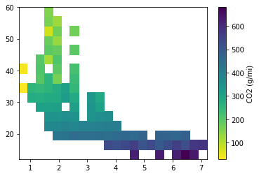


```python

```
